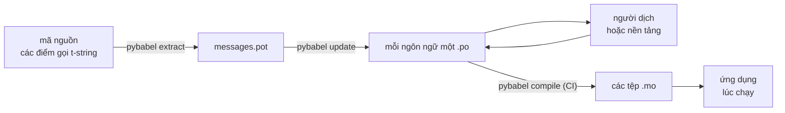

# Vận hành thực tế

[Hướng dẫn nhập môn](tutorial.md) chạy vòng lặp một lần, một mình, trên một
chương trình chỉ có một thông điệp. Trong một dự án thực, vòng lặp không
ngừng quay: thông điệp thay đổi sau khi đã được dịch, người dịch làm việc ở
nơi khác và theo lịch riêng của họ, và một catalog đã biên dịch được phát
hành cùng mỗi bản release. Trang này chính là phần thực hành đó — thứ gì ở
lại trong kho mã, thứ gì di chuyển, CI phải chặn những gì, và runtime gắn
ngôn ngữ ở đâu.

Cộng lại thì tất cả quy về sáu phép kiểm tra, nên xin nêu chúng ngay từ đầu;
mỗi mục bên dưới dựng nên một phép trong số đó.

- `pybabel update --check` chạy qua — không thông điệp nào đổi mà các catalog
  không hay biết.
- `pybabel compile` chặn bản build dựa trên mã thoát của nó.
- Những mục `fuzzy` còn sót lại là có chủ đích — mỗi mục như vậy kết xuất ra
  văn bản nguồn cho tới khi một người dịch xác nhận.
- Bộ kiểm thử kết xuất mỗi ngôn ngữ được phát hành đúng một lần với
  `strict=True`.
- Sản phẩm dành cho production chứa các tệp `.mo` và không chứa Babel.
- Logger `gettext_tstrings` được dẫn tới hệ thống giám sát.

## Hình hài của một dự án { #the-shape-of-a-project }

```text
myapp/
├── babel.cfg
├── pyproject.toml
├── src/
│   └── myapp/
└── locales/
    ├── messages.pot
    ├── ja/LC_MESSAGES/messages.po
    └── de/LC_MESSAGES/messages.po
```

Hãy commit `babel.cfg`, template `.pot`, và mọi tệp `.po` — chúng là nguồn
của bản build dịch thuật, và diff của chúng là cách bạn review các thay đổi
về bản dịch. Các tệp `.mo` đã biên dịch là sản phẩm build: hãy tạo chúng
trong CI hoặc lúc đóng gói thay vì commit, để một tệp `.po` và tệp `.mo` của
nó không bao giờ có thể bất đồng về thứ được xuất xưởng.

Có một tệp giữ vai trò theo mỗi chiều: `.pot` đưa thông điệp của bạn *ra*
tới người dịch, các tệp `.po` mang bản dịch *về*. Phần còn lại của trang này
là những gì di chuyển giữa hai đầu đó.



## Chu trình sau bản dịch đầu tiên { #the-cycle-after-the-first-translation }

Lệnh `pybabel init` trong Hướng dẫn nhập môn thường chỉ chạy một lần, khi một
ngôn ngữ được thêm vào. Từ đó trở đi, chu trình làm việc là **trích xuất →
cập nhật → dịch → biên dịch**, và tâm điểm của nó là `pybabel update`, lệnh gộp
template mới vào các catalog hiện có mà không vứt bỏ những bản dịch đã nằm sẵn
trong đó.

Giả sử lời chào `Hello {name}` — đã được dịch thành `こんにちは {name}` —
được viết lại trong mã thành `Welcome back, {name}`. Trích xuất và cập nhật:

```console
$ pybabel extract -F babel.cfg -c "Translators:" -o locales/messages.pot .
extracting messages from app.py (encoding="utf-8")
writing PO template file to locales/messages.pot
$ pybabel update -i locales/messages.pot -d locales
updating catalog locales/ja/LC_MESSAGES/messages.po based on locales/messages.pot
```

Catalog tiếng Nhật giờ chứa:

```po
#. gettext-tstrings
#: app.py:4
#, fuzzy, python-brace-format
msgid "Welcome back, {name}"
msgstr "こんにちは {name}"
```

Babel nhận thấy msgid mới giống một msgid vừa bị gỡ bỏ và ghép nó với bản
dịch cũ — nhưng đánh dấu cặp đó là **fuzzy**: một phỏng đoán của máy đang
chờ con người xác nhận. Cờ này thay đổi thứ được biên dịch ra. `pybabel
compile` **loại các mục fuzzy khỏi tệp `.mo`**, nên cho đến khi người dịch xác
nhận cặp đó, ứng dụng kết xuất văn bản tiếng Anh mới thay vì một câu tiếng Nhật
đã lỗi thời:

```console
$ pybabel compile -d locales
compiling catalog locales/ja/LC_MESSAGES/messages.po to locales/ja/LC_MESSAGES/messages.mo
$ python app.py
Welcome back, Ada
```

Vì vậy, một thông điệp bị thay đổi xuống cấp theo đúng cách một thông điệp
bị hỏng xuống cấp — quay về ngôn ngữ nguồn, không bao giờ về một bản dịch
lỗi thời. Phần việc của người dịch trong chu trình là sửa lại `msgstr` và
xóa cờ `fuzzy`; lần biên dịch kế tiếp sẽ nhặt mục đó lên.

!!! note "Tên placeholder là một phần danh tính của thông điệp"

    Msgid là khóa của catalog, và *tên* của placeholder nằm ngay bên trong
    nó — vì thế đổi tên một biến trong mã (`name` → `user_name`) làm thay
    đổi msgid và đẩy bản dịch của thông điệp đó ở mọi ngôn ngữ quay lại chu
    trình fuzzy. Hãy đặt tên các biến được nội suy bằng những từ mà người
    dịch hiểu được, và chỉ đổi tên khi có lý do.

    Định dạng là hình ảnh phản chiếu: `!r` và `:.2f` [không thuộc
    msgid](internals.md#from-template-to-msgid), nên siết `{amount:,.2f}`
    thành `{amount:,.0f}` không thay đổi gì trong bất kỳ catalog nào. Còn
    viết lại *câu văn*, dĩ nhiên, là một thay đổi thật — đó chính là chu
    trình ở trên.

## CI chặn những gì { #what-ci-gates }

Có ba thất bại đáng để build đỏ: các catalog tụt lại sau mã nguồn, một bản
dịch làm hỏng placeholder, hoặc một mục hỏng lọt qua tới runtime. Mỗi thất
bại một bước:

```yaml
- run: pybabel extract -F babel.cfg -c "Translators:" -o locales/messages.pot .
- run: pybabel update -i locales/messages.pot -d locales --check
- run: pybabel compile -d locales
- run: pytest
```

`pybabel update --check` không ghi lại gì và thoát với mã khác không khi một
catalog đã lỗi thời so với template vừa được trích xuất — tấm chắn chống
việc merge mã mà thông điệp của nó chưa được ai trích xuất lại. `pybabel
compile` chạy các phép kiểm placeholder của cả Babel lẫn
[checker đã đăng ký](extraction.md#your-existing-toolchain-validates-these-catalogs)
của gói này.

!!! bug "Babel 2.18.0: `--check` không thể chặn một catalog có dùng context"

    Trên Babel 2.18.0, `pybabel update --check` báo **mọi** catalog có chứa
    `msgctxt` là đã lỗi thời, ở mọi lần chạy, dù nó có mới đến đâu. Một cổng
    chặn lúc nào cũng đỏ còn tệ hơn là không có cổng nào, bởi cả nhóm sẽ tắt
    nó đi — nên nếu bạn có dùng `pgettext` hay `npgettext`, hãy thay bước này
    bằng thứ khác thay vì sống chung với nó. Đọc template và từng catalog bằng
    `babel.messages.pofile.read_po` rồi so sánh
    `{(m.context, m.id) for m in catalog if m.id}` là toàn bộ phép kiểm ấy,
    và đó chính là điều [build của chính trang này](index.md) làm. Nguyên nhân
    được [viết lại ở trang Cạm bẫy](pitfalls.md#your-tools-have-bugs-too).

!!! danger "Hãy kiểm tra mã thoát, đừng chỉ nhìn log"

    `pybabel compile` báo cáo từng lỗi placeholder, thoát với mã khác không
    — **và vẫn ghi tệp `.mo`**. Một pipeline biên dịch xong rồi sao chép
    `locales/` vào image sẽ xuất xưởng catalog hỏng, trừ khi mã thoát khác
    không thực sự chặn nó lại. Để bước đó làm build thất bại, như ở trên,
    chính là toàn bộ cách sửa.

Dòng cuối là bộ kiểm thử thường ngày của bạn, thêm vào một thói quen: đâu đó
trong nó, hãy kết xuất ít nhất một thông điệp cho mỗi ngôn ngữ được phát
hành thông qua một translator nghiêm ngặt —

```python
import gettext

from gettext_tstrings import Translator


def test_catalogs_render(language: str) -> None:
    translations = gettext.translation("messages", localedir="locales", languages=[language])
    _ = Translator(translations, strict=True)
    name = "Ada"
    assert _(t"Welcome back, {name}")
```

— bởi vì `strict=True` [ném lỗi ở nơi môi trường production sẽ lặng lẽ quay
về nguồn](guide.md#what-happens-when-a-catalog-is-wrong), và một lần kết
xuất lúc chạy là phép kiểm duy nhất nhìn thấy catalog đúng như cách ứng dụng
sẽ thấy nó, kể cả `.mo`.

## Làm việc với người dịch và các nền tảng dịch thuật { #working-with-translators-and-platforms }

Tệp `.po` là định dạng trao đổi của cả thế giới gettext, và đó là lý do thư
viện này tái sử dụng nó: bàn giao việc dịch nghĩa là bàn giao một tệp, dù
người nhận là một đồng nghiệp dùng trình soạn thảo PO hay một nền tảng như
Weblate hoặc Crowdin. Ba điều làm cho cuộc bàn giao ấy suôn sẻ:

**Nói rõ thông điệp dùng để làm gì.** Một chú thích trong mã sẽ đi cùng
thông điệp — đó là thứ cờ `-c "Translators:"` thu thập:

```python
from gettext_tstrings import tr

name = "Ada"
# Translators: shown on the dashboard right after sign-in
print(tr(t"Welcome back, {name}"))
```

```po
#. Translators: shown on the dashboard right after sign-in
#. gettext-tstrings
#: app.py:5
#, python-brace-format
msgid "Welcome back, {name}"
msgstr ""
```

Người dịch thấy chú thích đó trong trình soạn thảo của họ, ngay cạnh thông
điệp, ở bên kia địa cầu. Đó là đòn bẩy chất lượng rẻ nhất trong toàn bộ quy
trình. Với một từ tự nó là từ đồng âm — "Open" của cái nút so với "Open" của
trạng thái — hãy cho thông điệp một [ngữ cảnh](guide.md#binding-a-catalog)
bằng `pgettext`, thứ sẽ trở thành một `msgctxt` hiện rõ trong catalog.

**Để nền tảng xác thực placeholder.** Mọi thông điệp trích xuất từ t-string
đều mang cờ `python-brace-format`, và chính dòng đó là thứ bật QA
placeholder trong những công cụ bạn không kiểm soát — Weblate ghi rõ phép
kiểm này trong tài liệu, các nền tảng thương mại neo phép kiểm của riêng họ
vào cùng cờ đó, và `msgfmt --check-format` cưỡng chế nó trong bất kỳ
pipeline GNU nào. Chi tiết, cùng những gì checker đi kèm bắt được ngoài
chúng, nằm ở
[trang Trích xuất](extraction.md#your-existing-toolchain-validates-these-catalogs).

**Chỉ tin lưới an toàn đúng tới mức nó vươn tới.** Bất cứ thứ gì quay về từ
một nền tảng vẫn là dữ liệu đi vào bản build của bạn; các cổng chặn CI ở
trên là thứ biến "nền tảng có lẽ đã kiểm tra rồi" thành "thứ này không thể
được phát hành trong tình trạng hỏng".

## Gắn ngôn ngữ lúc chạy { #binding-a-language-at-runtime }

Mọi thứ đến giờ đều tạo ra catalog. Quyết định còn lại là ứng dụng chọn một
catalog ở đâu. Hãy gắn một lần cho mỗi *phạm vi của một ngôn ngữ* — tiến
trình đối với CLI, request đối với dịch vụ web.

=== "Một tiến trình, một ngôn ngữ"

    Một công cụ dòng lệnh hoặc ứng dụng desktop đọc môi trường của người
    dùng một lần, lúc khởi động. Không truyền `languages=` để thư viện chuẩn
    tự thương lượng từ `LANGUAGE`, `LC_ALL`, `LC_MESSAGES`, và `LANG`;
    `fallback=True` trả về một catalog rỗng — tức văn bản nguồn — thay vì
    ném lỗi khi không giá trị nào trong số đó khớp với catalog bạn phát
    hành.

    ```python
    import gettext

    from gettext_tstrings import Translator

    _ = Translator(gettext.translation("messages", localedir="locales", fallback=True))

    name = "Ada"
    print(_(t"Welcome back, {name}"))
    ```

=== "Flask"

    Một ứng dụng web quyết định theo từng request. Nạp mỗi catalog một lần
    lúc import, rồi gắn catalog đã thương lượng vào ngữ cảnh trước khi view
    chạy — [`set_translations`](guide.md#per-request-language) là cục bộ
    theo ngữ cảnh, nên các request đồng thời ở những ngôn ngữ khác nhau
    không bao giờ thấy binding của nhau.

    ```python
    import gettext

    from flask import Flask, request

    from gettext_tstrings import set_translations, tr

    LANGUAGES = ("en", "ja", "de")
    CATALOGS = {
        language: gettext.translation(
            "messages", localedir="locales", languages=[language], fallback=True
        )
        for language in LANGUAGES
    }

    app = Flask(__name__)


    @app.before_request
    def bind_language() -> None:
        language = request.accept_languages.best_match(LANGUAGES) or "en"
        set_translations(CATALOGS[language])


    @app.get("/")
    def home() -> str:
        name = "Ada"
        return tr(t"Welcome back, {name}")
    ```

=== "ASGI middleware"

    Dưới các framework bất đồng bộ — FastAPI, Starlette, và mọi thứ ASGI
    khác — hãy bọc request trong
    [`use_translations`](guide.md#per-request-language): binding sống trong
    một `ContextVar`, thứ mà cơ chế chuyển đổi task bất đồng bộ bảo toàn
    theo từng request.

    ```python
    import gettext

    from fastapi import FastAPI, Request

    from gettext_tstrings import tr, use_translations

    LANGUAGES = ("en", "ja", "de")
    CATALOGS = {
        language: gettext.translation(
            "messages", localedir="locales", languages=[language], fallback=True
        )
        for language in LANGUAGES
    }

    app = FastAPI()


    @app.middleware("http")
    async def bind_language(request: Request, call_next):
        language = negotiate_language(request.headers.get("accept-language"), LANGUAGES)
        with use_translations(CATALOGS[language]):
            return await call_next(request)
    ```

    `negotiate_language` đại diện cho phần phân tích Accept-Language của
    bạn — hầu hết các framework hoặc hệ sinh thái của chúng đều cung cấp
    sẵn; điều quan trọng ở đây là binding bao quanh `call_next`.

Hai thói quen lúc chạy sẽ hoàn tất bức tranh. Những chuỗi được tạo lúc
import — nhãn của một form, tên hiển thị của một enum — không được phép giữ
chặt ngôn ngữ nào đó đang hoạt động trong lúc import; hãy định nghĩa chúng
bằng [`lazy_gettext`](guide.md#deferred-translation) và chúng sẽ kết xuất
theo ngôn ngữ đang hoạt động lúc *sử dụng*. Và hãy định tuyến logger
`gettext_tstrings` tới nơi có con người nhìn vào: các cảnh báo của nó là chế
độ khoan dung đang báo cáo một bản dịch đã lọt qua mọi cổng chặn, mỗi thông
điệp hỏng một dòng thay vì mỗi lần kết xuất một dòng.

## Phát hành { #shipping }

Môi trường production cần gói phần mềm, các tệp `.mo`, và không gì khác.
Babel là phụ thuộc dành cho phát triển và CI — hãy giữ
`gettext-tstrings[babel]` bên ngoài image production và chỉ cài gói trần ở
đó; việc kết xuất chạy hoàn toàn trên thư viện chuẩn. Hãy biên dịch catalog
trong chính bản build tạo ra sản phẩm bạn triển khai, để các tệp `.mo` bên
trong nó đúng là các tệp `.po` đã được review, và không thứ gì biên dịch
trên laptop của ai đó từng được xuất xưởng.

Cách chúng đi theo sản phẩm còn tùy vào thứ bạn triển khai. Một wheel mang
chúng dưới dạng package data, nghĩa là các catalog phải nằm *bên trong* thư
mục gói — `src/myapp/locales/`, chứ không phải một `locales/` ở cấp cao nhất
— và build backend phải được báo cho biết để đưa vào cả những tệp mà
`.gitignore` thường che đi:

=== "Hatchling"

    ```toml
    [tool.hatch.build]
    # .mo files are build output, so they are gitignored; name them or the
    # wheel ships without a single translation.
    artifacts = ["src/myapp/locales/**/*.mo"]
    ```

=== "setuptools"

    ```toml
    [tool.setuptools.package-data]
    myapp = ["locales/*/LC_MESSAGES/*.mo"]
    ```

Hãy đọc chúng trở lại qua chính gói phần mềm, thay vì qua một đường dẫn
tương đối với cây mã nguồn — thứ không còn tồn tại ngay khi wheel được cài
đặt:

```python
import gettext
from importlib.resources import as_file, files

with as_file(files("myapp") / "locales") as localedir:
    translations = gettext.translation("messages", localedir=localedir, languages=["ja"])
```

Một container image có việc dễ hơn: biên dịch trong stage build rồi sao chép
kết quả, để Babel ở lại trong stage đó.

```dockerfile
FROM python:3.14-slim AS build
COPY . /src
RUN cd /src && python -m pip install ".[babel]" \
    && pybabel compile -d src/myapp/locales

FROM python:3.14-slim
COPY --from=build /src /src
RUN python -m pip install /src   # no [babel]: rendering needs the stdlib only
```

Trước một bản phát hành, danh sách kiểm tra mà trang này quy về là:

- `pybabel update --check` chạy qua — không thông điệp nào thay đổi mà các
  catalog không hay biết.
- `pybabel compile` chặn bản build bằng mã thoát của nó.
- Các mục `fuzzy` còn lại đều là có chủ ý — mỗi mục sẽ kết xuất thành văn
  bản nguồn cho đến khi người dịch xác nhận nó.
- Bộ kiểm thử kết xuất mỗi ngôn ngữ được phát hành một lần với
  `strict=True`.
- Sản phẩm production chứa các tệp `.mo` và không chứa Babel.
- Logger `gettext_tstrings` được định tuyến tới hệ thống giám sát.

## Tiếp theo { #where-next }

- [Trích xuất](extraction.md) — tài liệu tham chiếu cho nửa công cụ của
  trang này: các tùy chọn mapping, tên hàm tùy biến, chế độ nghiêm ngặt, và
  từng checker.
- [Cẩm nang](guide.md) — nửa lúc chạy: số nhiều, ngữ cảnh, chuỗi trì hoãn,
  và chi tiết các chế độ hỏng hóc.
- [Cách hoạt động](internals.md) — vì sao msgid trông như nó trông, và việc
  xác thực thực sự kiểm những gì.
