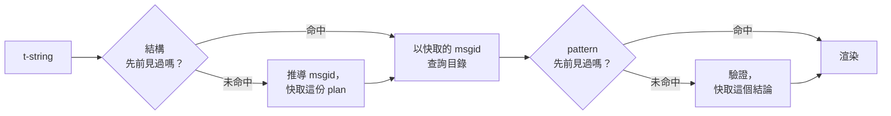

# 運作原理

本頁的內容對於使用本函式庫並非必要——[教學](tutorial.md)與[指南](guide.md)
已經涵蓋了那些。本頁改以第一原理重新建構這套函式庫：t-string 到底是什麼、
msgid 如何從中自然導出、一則翻譯要怎樣才算有效，以及實作如何讓上述所有檢查
只花掉零點幾微秒。如果你只是好奇、想參與貢獻，或打算
[自行實作這套約定](#reimplementing-it)，就讀下去吧。

## t-string 到底是什麼 { #what-a-t-string-actually-is }

f-string 產生一個 `str`，而且是立刻產生——等到任何函式收到它時，值早已插入，
句子也已定案。t-string（[PEP 750]）語法相同，其中的運算式同樣是急切求值，
但產生的卻是另一種型別：

```pycon
>>> name = "Ada"
>>> f"Hello {name}!"
'Hello Ada!'
>>> t"Hello {name}!"
Template(strings=('Hello ', '!'), interpolations=(Interpolation('Ada', 'name', None, ''),))
```

那個 `Template` 物件把目錄流程所需的各個部分保留下來，而且仍然彼此分離：

```pycon
>>> template = t"Total: {amount:,.2f}"
>>> template.strings
('Total: ', '')
>>> template.interpolations[0].expression
'amount'
>>> template.interpolations[0].value
1234.5
>>> template.interpolations[0].format_spec
',.2f'
```

- `strings` — 插值周圍的字面文字，依序排列。
- 每個插值各自帶著：作為原始碼文字的**運算式**（`'amount'`）、求值後的
  **值**（`1234.5`），以及可能有的**轉換**（`!r`）與**格式規格**
  （`,.2f`）——它們是被分開攜帶的，而不是先套用掉。

本函式庫所做的一切，不過是有紀律地消費這個結構。語言本身已經完成了 i18n
唯一需要的那道分離——靜態文字與值各自獨立——所以本函式庫從不解析你的原始碼，
也從不猜測某個值落在句子的哪個位置。剩下的只有三個決定：這個結構如何變成
目錄的 key、該 key 的翻譯可以說些什麼，以及兩者如何重新渲染在一起。

## 從 template 到 msgid { #from-template-to-msgid }

msgid——目錄用來索引的 key——只從 template 的*靜態*部分推導而來。依原始碼
順序走過 `strings` 與 `interpolations`；為每段字面片段做大括號跳脫（`{`
變成 `{{`）；每個插值輸出一個 `{name}` token，其中 `name` 是去掉前後空白的
運算式文字。以 `t"Total: {amount:,.2f}"` 為例：

```text
strings         ('Total: ', '')
interpolations  expression 'amount'   conversion None   format_spec ',.2f'
msgid           'Total: {amount}'
```

這條規則的每一部分都有其道理：

- **運算式必須是單純的名稱**——`str.isidentifier()` 為真，且不是 Python
  關鍵字。`t"Hello {user.name}"` 在呼叫端就會被拒絕。msgid 是一個 *key*：
  它必須在每一次執行、每一次擷取都產出完全相同的結果，而且是給譯者閱讀的，
  因此佔位符必須是穩定又有意義的詞——而不是一段引誘目錄變成運算式語言的
  程式碼片段。
- **轉換與格式規格永遠不會進入 msgid。** 譯者不該被迫去讀 `:,.2f`，任何
  翻譯也不該有能力改動它。它的推論值得記住：把程式碼裡的 `:,.2f` 收緊成
  `:,.0f` 不會改變任何 msgid，因此不會讓任何語言的任何翻譯失效。目錄的 key
  追蹤的是*這句話說了什麼*，而不是值被格式化成什麼樣子。
- **重複出現的名稱必須完全重複同樣的格式。**
  `t"{x:.2f} vs {x:.3f}"` 會被拒絕，因為兩次出現都會塌縮成同一個 `{x}`
  token，msgid 也就再也說不清楚渲染時該採用哪一種格式。
- **空的 msgid 永遠不會被查詢**，因為 gettext 把它保留給目錄自身的中繼資料
  標頭。`t""` 會渲染成 `""`，完全不碰目錄。

完整的規則集合，包括本頁略過的邊界情況，請見
[SPEC §2](https://github.com/yhay81/gettext-tstrings/blob/main/SPEC.md)。

## 翻譯可以說些什麼 { #what-a-translation-may-say }

從目錄回來的 pattern 會用 `string.Formatter`——也就是 `str.format` 所用的
同一套解析器——來剖析。這套文法是刻意借來的，而不是自己發明的：本函式庫
接受的 pattern，正是整個生態系早已理解的那種。接著會套用兩項檢查。

**形態：**每個欄位都必須是裸的 `{name}`。帶轉換或格式規格的——包括明確寫成
空的 `{name:}`——都會被拒絕，位置欄位（`{0}`、`{}`）以及名稱前後帶空白的
`{ name }` 同樣被拒。最後一項的份量比表面上更重：`str.format` 與 GNU
`msgfmt` 都會拒絕 `{ name }`，所以這裡若接受它，就會產出鏈條上其他工具都
無法驗證的目錄。

**名稱：**把 pattern 的佔位符集合拿來和來源訊息的集合比對。對單數訊息而言，
每個來源名稱都是*必要*的，此外一律不*允許*。對複數訊息，兩個分支會被合併：

- **允許** = 兩個分支名稱的聯集
- **必要** = 兩者的交集

因此對照 `t"One file"` / `t"{n} files"`，名稱 `n` 在任一形式的翻譯裡都被
允許，卻對哪一種形式都不是必要。正是這份不對稱，讓目標語言的複數系統得以
不同於來源語言——日文用一個（多半會用到 `{n}` 的）形式翻完兩個分支；形式比
英文更多的語言，則可能需要在英文原本沒有的形式裡用上 `{n}`。

這些都不是紙上談兵：本站自己的介面目錄裡就有一則複數訊息
`Built {n} localized page` / `Built {n} localized pages`——兩個英文分支——
而本站的各語言版本把這同一則訊息翻成了從一種到六種不等的形式：

| 目錄 | 形式數 | 各形式的譯文，依形式順序 |
| --- | --- | --- |
| 日文 | 1 | `ローカライズ済みページを{n}件ビルドしました` |
| 土耳其文 | 2 | `{n} yerelleştirilmiş sayfa oluşturuldu` ——兩次，一字不差：土耳其文名詞接在數詞之後仍維持單數 |
| 義大利文 | 2 | `Generata {n} pagina localizzata` · `Generate {n} pagine localizzate` ——分詞會隨性別與數變化 |
| 拉脫維亞文 | 3 | `Izveidota {n} lokalizēta lapa` · `Izveidotas {n} lokalizētas lapas` · `Izveidots {n} lokalizētu lapu` ——第三種形式只為**零**而設 |
| 俄文 | 3 | `Собрана {n} локализованная страница` · `Собраны {n} локализованные страницы` · `Собрано {n} локализованных страниц` |
| 波蘭文 | 3 | `Zbudowano {n} zlokalizowaną stronę` · `Zbudowano {n} zlokalizowane strony` · `Zbudowano {n} zlokalizowanych stron` |
| 斯洛維尼亞文 | 4 | `Zgrajena {n} lokalizirana stran` · `Zgrajeni {n} lokalizirani strani` · `Zgrajene {n} lokalizirane strani` · `Zgrajenih {n} lokaliziranih strani` ——第二種是**雙數**，剛好用於二 |
| 愛爾蘭文 | 5 | `Tógadh {n} leathanach logánaithe` · `Tógadh {n} leathanaigh logánaithe` ——依序為一、二、3–6、7–10 與其餘；詞幹會交替，但 *leathanach* 以 `l` 開頭，而愛爾蘭文的字首變音都不會寫在 `l` 上，因此好幾種形式重合 |
| 阿拉伯文 | 6 | 其中有表示剛好一個的 `تم إنشاء صفحة مترجمة واحدة ({n})`，也有表示少數幾個的 `تم إنشاء {n} صفحات مترجمة` |

每一列都是本儲存庫 `i18n/*/LC_MESSAGES/site.po` 裡真正存在的條目，由
[多語言建置](index.md)在每次發行時渲染出來——而且有一個測試把這張表釘在
那些目錄上，兩者因此不可能各走各的。

在這些界線之內，調換順序與重複使用是刻意不加限制的。兩者在真實語言裡都有
文法上的必要，而限制出現次數只會拒絕正確的翻譯，換不到任何安全上的好處：
翻譯依然無法*求值*任何東西，因為求值路徑根本不存在——佔位符只會按名稱到
template 已算好的值裡查找，永遠不會被交給 `eval`、`getattr` 或
`str.format` 本身。

## 渲染 { #rendering }

渲染一個通過驗證的 pattern，就是走過它的每個區塊：輸出每段字面內容，並為
每個佔位符取出插值捕捉到的值，套上*來源端*的轉換與格式規格——
`format(convert(value, conversion), format_spec)`。過程中維持兩項保證：

- **每個相異的值在一次渲染中最多只格式化一次**，即使翻譯重複了同一個
  佔位符也一樣。重複改變的是結果被插入幾次，而不是你的 `__format__` 被執行
  幾次。
- **複數情況下，佔位符會讀取當初定義它的那個分支。** 兩個分支都有的名稱，
  讀的是*來源*語言所選分支（`n == 1` 時為 `singular`，否則為 `plural`）
  捕捉到的值；只屬於某一分支的名稱則永遠讀自己的分支，即使目標語言的複數
  規則讓它出現在另一種形式裡也是如此。

當驗證在渲染時失敗，處理方式取決於這個 pattern 由誰提供。來自*目錄*的
pattern 會降級：記錄一則警告並改為渲染來源文字，藉此守住 gettext
「壞掉的目錄絕不拖垮應用程式」的承諾（[指南展示了兩種模式](guide.md#what-happens-when-a-catalog-is-wrong)）。
呼叫端直接傳進來的 pattern——`CompiledTemplate.render`——則一律拋出例外，
因為根本沒有可供*回退*的來源文字；寬容是為目錄查詢而設，不是為引數而設。

## 診斷也是設計的一部分 { #diagnostics-are-part-of-the-design }

佔位符錯誤通常擺在譯者而非程式設計師面前，而且往往出現在一個看不出問題的
檔案裡。對著一位在編輯器中明明看得到那幾個字元的人說 `{name} is missing`
根本是條死路，因此這些訊息是依三條規則算出來的：

- 名稱中含有**不可見字元**——輸入法產生的 no-break space、zero-width
  space——會就地把該字元換成它的碼位再印出：`{<U+00A0>name}`。讀者需要看到
  *它在哪裡*。
- 字母**混用了不同書寫系統**的名稱，也就是同形異字的情況，會被顯示兩次——
  一次好讀，一次跳脫——因為含有西里爾字母 `а` 的 `{nаme}` 印出來與
  `{name}` 無從分辨，而跳脫後的 `(nаme)` 是唯一能把兩者區別開來的寫法。
- 其餘一律**照原樣顯示**。`{名前}` 與 `{café}` 都是普通名稱；把它們跳脫
  只會讓讀者找不到所指為何。

基於同樣的原則，一個*看起來*明明在的「缺失」佔位符，也會附上它為何算缺席的
說明——東亞輸入法打出的全形大括號、跳脫來回一趟造成的 `{{name}}` 加倍、
名稱其實落在大括號之外。[指南的失敗訊息判讀表](guide.md#reading-a-failure-message)
逐字列出了這些訊息。

## 熱路徑 { #the-hot-path }

以上這一切，會發生在應用程式渲染的每一條翻譯字串上，因此實作是圍繞著一個
想法建構的：**驗證永遠不會被略過，所以該被快取的正是驗證本身。**



三層快取，每個階段一層：

- **每個呼叫點結構一份 plan。** template 的 `strings` tuple——直譯器本來
  就已經建好的物件——就是快取的 key，所以一次查找不會配置任何記憶體。命中
  時，仍會把每個插值的運算式、轉換與格式規格拿來和記錄下來的值逐一比對：
  兩個字面文字相同、格式卻不同的呼叫點（`t"{x:.2f}"` 對上 `t"{x:.3f}"`）
  絕不能互撞，而這道比對就是使用直譯器免費奉上的 key 所要付出的代價。
- **每個 pattern 一份結論。** 目錄第一次以某個 pattern 回答時，它會被剖析
  並驗證；結果——一份編譯好的渲染 plan，或是一筆無效紀錄——會保存在 plan
  上。之後該訊息的每次渲染，都只要一次字典查找就能取得。無效的 pattern
  同樣會被記住，這正是壞掉的目錄條目只警告一次、而非每次渲染都警告的原因。
- **每組複數配對一份合併後的 plan**，其中保存聯集／交集的集合，讓分支運算
  按訊息只做一次，而不是每次呼叫都做一次。

每一層快取都有上限，而且沒有任何一層保留插值的*值*——只保留靜態結構與
pattern 文字。由
[`benchmarks/runtime.py`](https://github.com/yhay81/gettext-tstrings/blob/main/benchmarks/runtime.py)
測得的結果是：一則單欄位訊息約 0.4 µs，其中已包含建構 t-string 本身，大約
是什麼都不檢查的普通 `gettext(...).format(...)` 的 2.5 倍。
[`core.py`](https://github.com/yhay81/gettext-tstrings/blob/main/src/gettext_tstrings/core.py)
開頭的註解記錄了構成這個結論的各項個別測量。

## 自行實作 { #reimplementing-it }

以上沒有一項是私藏的密技：這套約定已經寫成 [spec v1](spec.md)，其機器可讀的
[一致性測試套件](spec.md#conformance)讓擷取器、IDE 外掛，或另一種語言寫成的
實作，都能對照本頁講解過的每一條規則自我檢驗。本實作會在自己的測試中執行
這套測試，這正是讓本頁、規範與程式碼不至於在無聲無息中各自漂移的機制。

  [PEP 750]: https://peps.python.org/pep-0750/
