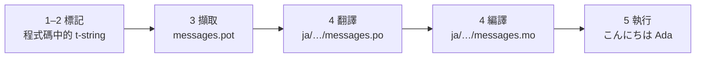

# 教學

本頁從一個空資料夾走到一支會用日文打招呼的程式。五個步驟，不預設你有 gettext
經驗，而且每道指令都附上它實際產生的輸出——因此每走一步，你都知道自己有沒有走
在正確的路上。

你需要 Python 3.14 以上，因為 t-string 是 3.14 才有的新語法。日文是本頁的範例
目標語言，但沒有任何東西取決於這個選擇。想換成別的語言，把第 4 步的 `ja` 換掉
就好——那個 locale 代碼是唯一指名它的地方。

## 1. 安裝 { #1-install }

```console
python -m pip install "gettext-tstrings[babel]"
```

`[babel]` extra 會帶進 [Babel]，也就是第 3 步把你的訊息收集進目錄檔的工具。它是
開發階段的工具：正式環境的程式碼只靠標準函式庫就能完成渲染。

## 2. 在程式碼中標記一則訊息 { #2-mark-a-message-in-your-code }

建立 `app.py`：

```python
from gettext_tstrings import tr

name = "Ada"
print(tr(t"Hello {name}"))
```

`t"Hello {name}"` 看起來像 f-string，但 `t` 前綴會讓文字與值保持分離，而不是當場
合併。正是這份分離，讓 `tr()` 能夠為 `Hello {name}` 這整句話查詢翻譯，之後才把值
插進去。

現在就執行看看：

```console
$ python app.py
Hello Ada
```

目前還沒安裝任何翻譯，所以原文照原樣渲染。使用本函式庫的程式從不*要求*有目錄才能
執行——英文（或你的來源語言）就是內建的回退。

## 3. 擷取訊息 { #3-extract-the-messages }

譯者通常是看目錄工作，而不是看原始碼，因此在你和他們之間往返的，是一個叫做**目錄**
的小檔案。走向目錄的第一步，就是把程式碼裡每一則被標記的訊息收集出來。

建立 `babel.cfg`，告訴 Babel 該怎麼找到你的訊息：

```ini
[gettext_tstrings: **.py]
encoding = utf-8
```

接著擷取成樣板檔（`.pot`）：

```console
$ mkdir -p locales
$ pybabel extract -F babel.cfg -c "Translators:" -o locales/messages.pot .
extracting messages from app.py (encoding="utf-8")
writing PO template file to locales/messages.pot
```

`locales/messages.pot` 現在為每一則訊息各含一筆條目：

```po
#. gettext-tstrings
#: app.py:4
#, python-brace-format
msgid "Hello {name}"
msgstr ""
```

`msgid` 就是你的程式碼將要查詢的 key。空的 `msgstr` 是填翻譯的地方——但不是填在
這個檔案裡：`.pot` 是*樣板*，下一步會為每種語言各複製一份。

## 4. 翻譯並編譯 { #4-translate-and-compile }

從樣板建立日文目錄：

```console
$ pybabel init -i locales/messages.pot -d locales -l ja
creating catalog locales/ja/LC_MESSAGES/messages.po based on locales/messages.pot
```

打開 `locales/ja/LC_MESSAGES/messages.po` 並填入 `msgstr`：

```po
msgid "Hello {name}"
msgstr "こんにちは {name}"
```

`{name}` 要原封不動地保留——佔位符就是值在譯文句子裡找到自己位置的方式，而翻譯
可以自由把它移到目標語言需要的任何地方。在真實專案中，這個 `.po` 檔就是你交給
譯者或上傳到翻譯平台的東西；兩種做法的格式完全相同。

目錄以文字形式編輯，卻以二進位形式（`.mo`）載入，所以要編譯：

```console
$ pybabel compile -d locales
compiling catalog locales/ja/LC_MESSAGES/messages.po to locales/ja/LC_MESSAGES/messages.mo
```

這道指令同時也是一張安全網。如果翻譯弄壞了佔位符——比方說把 `{name}` 寫成
`{nome}`——它不會放行：

```console
$ pybabel compile -d locales
error: locales/ja/LC_MESSAGES/messages.po:24: translation does not match the
source placeholders: {name} is missing; {nome} is not in the source message
1 errors encountered.
```

這裡有一個現在就該知道的但書：它會回報錯誤並以非零狀態結束，但還是會把 `.mo`
寫出來。在真實專案裡，必須由 CI 依那個結束狀態把流程擋下來——
[正式環境實務](workflow.md#what-ci-gates)會把這件事設定起來。

## 5. 執行 { #5-run-it }

第 2–4 步用的是 `tr()`，它會去找目錄，但找不到。現在目錄有了，把它載入並繫結一
次：`Translator` 會抓著一份目錄，讓各個呼叫點不必自己指名；而 `_` 就是 gettext
中對這個結果的慣用名稱。

讓 `app.py` 指向編譯好的目錄。點開標記，看看每一行在做什麼：

```python
import gettext

from gettext_tstrings import Translator

_ = Translator(gettext.translation("messages", localedir="locales", languages=["ja"]))  # (1)!

name = "Ada"
print(_(t"Hello {name}"))  # (2)!
```

1. 標準函式庫載入編譯好的 `.mo`，`Translator` 再把它繫結成一個可呼叫物件。`_`
   是 gettext 中「把這句翻出來」的慣用名稱——之所以這麼短，是因為它會出現在
   每一條面向使用者的字串上。它做的翻譯和 `tr` 相同，只是繫結了一份目錄。
2. 在呼叫處：t-string 的文字變成查詢用的 key `Hello {name}`，目錄回答
   `こんにちは {name}`，這個答案會先與來源佔位符核對，通過之後才把值放進去。

```console
$ python app.py
こんにちは Ada
```

這就是完整的循環，值得把它看成一張圖：



**標記 → 擷取 → 翻譯 → 編譯 → 執行。** 本站其餘的內容，都是這五個步驟其中之一的
細部展開。

## 接下來 { #where-next }

- [為什麼選擇 t-string](comparison.md) — 和 `%(name)s`、`.format()` 與
  `$`-string 相比，這套設計替你擋掉了什麼。
- [指南](guide.md) — 複數、逐請求切換語言、延遲字串，以及目錄真的出錯時執行階段
  會發生什麼事。
- [正式環境實務](workflow.md) — 同一個循環在團隊裡週復一週的運轉方式：更新目錄、
  CI 關卡與翻譯平台。
- [擷取](extraction.md) — 完整的 `pybabel` 參考：自訂函式名稱、CI 的 strict
  模式，以及守護你目錄的各項檢查。
- [遷移](migration.md) — 如果你真正想套用這套做法的專案，已經有 gettext 目錄了。
- [給譯者](translators.md) — 可以直接交給實際填寫那些 `msgstr` 的人的一頁。

  [Babel]: https://babel.pocoo.org/
