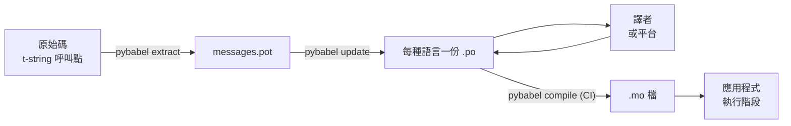

# 正式環境實務

[教學](tutorial.md)把這個循環跑了一次，獨自一人，對象是一支只有一則訊息的程式。
在真實專案裡，這個循環會一直轉下去：訊息在被翻譯之後還會改動，譯者在別的地方、
按自己的節奏工作，而每一次發行都會帶著一份編譯好的目錄出貨。本頁講的就是那份實務——
什麼留在儲存庫裡、什麼會往外流動、CI 必須把守什麼，以及執行階段在哪裡繫結語言。

## 一個專案的形態 { #the-shape-of-a-project }

```text
myapp/
├── babel.cfg
├── pyproject.toml
├── src/
│   └── myapp/
└── locales/
    ├── messages.pot
    ├── ja/LC_MESSAGES/messages.po
    └── de/LC_MESSAGES/messages.po
```

把 `babel.cfg`、`.pot` 樣板，以及每一份 `.po` 都提交進版控——它們是翻譯建置的來源，
而它們的 diff 就是你審查翻譯異動的方式。編譯出來的 `.mo` 檔則是建置產物：請在 CI 或
打包時產生它們，而不要提交進版控，這樣一份 `.po` 和它的 `.mo` 就絕不可能對「到底出貨
了什麼」各說各話。

有一個檔案在兩個方向上各有其角色：`.pot` 把你的訊息帶*出去*給譯者，`.po` 檔則把翻譯
帶*回來*。以下所有內容，都是這兩者之間的往來。



## 第一次翻譯之後的週期 { #the-cycle-after-the-first-translation }

教學裡的 `pybabel init` 每種語言一輩子只跑一次。從那之後，日常運轉的週期就是
**擷取 → 更新 → 翻譯 → 編譯**，而它的核心是 `pybabel update`：它把一份新的樣板併進
既有目錄，同時不丟掉裡面已經有的翻譯。

假設那句招呼語 `Hello {name}`——已經被翻成 `こんにちは {name}`——在程式碼裡被改寫成
`Welcome back, {name}`。擷取並更新：

```console
$ pybabel extract -F babel.cfg -c "Translators:" -o locales/messages.pot .
extracting messages from app.py (encoding="utf-8")
writing PO template file to locales/messages.pot
$ pybabel update -i locales/messages.pot -d locales
updating catalog locales/ja/LC_MESSAGES/messages.po based on locales/messages.pot
```

日文目錄現在含有：

```po
#. gettext-tstrings
#: app.py:4
#, fuzzy, python-brace-format
msgid "Welcome back, {name}"
msgstr "こんにちは {name}"
```

Babel 注意到這個新的 msgid 和某個被移除的很像，就把它和舊的翻譯配成了一對——但把這
一對標上了 **fuzzy**：一台機器的猜測，等著人來確認。這個旗標是有牙齒的。
`pybabel compile` 會**把 fuzzy 條目排除在 `.mo` 之外**，所以在譯者確認這一對之前，
應用程式渲染的是新的英文文字，而不是過時的日文：

```console
$ pybabel compile -d locales
compiling catalog locales/ja/LC_MESSAGES/messages.po to locales/ja/LC_MESSAGES/messages.mo
$ python app.py
Welcome back, Ada
```

因此一則被改動的訊息，降級的方式和一則壞掉的訊息完全相同——降到來源語言，絕不降到
一則過時的翻譯。譯者在這個週期裡的部分，就是修訂 `msgstr` 並刪掉 `fuzzy` 旗標；
下一次編譯就會把這筆條目收進去。

!!! note "佔位符名稱是訊息身分的一部分"

    msgid 就是目錄的 key，而佔位符的*名稱*就在它裡面——所以在程式碼裡把一個變數改名
    （`name` → `user_name`）就會改變 msgid，並把每一種語言對它的翻譯都送回 fuzzy
    週期一趟。請把被插值的變數命名成譯者看得懂的詞，並且只在有理由時才改名。

    格式設定則是它的鏡像：`!r` 與 `:.2f` [不是 msgid 的一部分](internals.md#from-template-to-msgid)，
    所以把 `{amount:,.2f}` 收緊成 `{amount:,.0f}` 不會改動任何目錄裡的任何東西。
    當然，改寫*句子*本身是一項真正的變更——那就是上面那個週期。

## CI 把守什麼 { #what-ci-gates }

有三種失敗值得讓建置變紅：目錄落後於程式碼、某則翻譯弄壞了佔位符，或一筆壞掉的條目
一路溜到了執行階段。一種失敗對應一個步驟：

```yaml
- run: pybabel extract -F babel.cfg -c "Translators:" -o locales/messages.pot .
- run: pybabel update -i locales/messages.pot -d locales --check
- run: pybabel compile -d locales
- run: pytest
```

`pybabel update --check` 什麼都不會改寫，而當某份目錄與剛擷取出來的樣板不同步時，
它會以非零狀態結束——這正是防止有人合併了訊息卻沒人重新擷取的那道防線。
`pybabel compile` 則會跑 Babel 與本套件
[所註冊的檢查器](extraction.md#your-existing-toolchain-validates-these-catalogs)兩邊的
佔位符檢查。

!!! bug "`--check` 沒辦法把守使用了上下文的目錄"

    在 Babel 2.18.0 上，`pybabel update --check` 會把**每一份**含有 `msgctxt` 的目錄
    都報成過期，每次執行都如此，不管它其實多麼新。這個比較走的是
    `Catalog.is_identical`，它會用每則訊息被存放時所用的 key 去查找——而對一則帶上下文
    的訊息來說，那個 key 是 `(id, context)` 這一對，`Catalog.get` 並不接受它。查找回來
    的是空的，於是兩份目錄永遠比不出相等：

    ```pycon
    >>> from babel.messages.catalog import Catalog
    >>> c = Catalog(locale="ja")
    >>> c.add("Guide", "ガイド", context="navigation")
    <Message 'Guide' (flags: [])>
    >>> c.is_identical(c)
    False
    ```

    所以只要你有用到 `pgettext` 或 `npgettext`——而消解同形異義詞的歧義正是它們存在的
    理由——這個步驟就會以最糟的方式失效：永遠是紅的，於是團隊把它關掉，於是再也沒有
    東西在把守過期問題。在上游修好之前，請自己比較訊息集合。用
    `babel.messages.pofile.read_po` 讀進樣板與每一份目錄，再比較
    `{(m.context, m.id) for m in catalog if m.id}`，這就是整項檢查的全部，而
    [本站自己的建置](index.md)做的正是這件事。

!!! danger "看離開狀態碼，不要看日誌"

    `pybabel compile` 會回報每一個佔位符錯誤、以非零狀態結束——**然後還是照樣把 `.mo`
    寫出來**。一條先編譯、再把 `locales/` 複製進映像檔的流水線，除非那個非零離開狀態
    真的把它擋下來，否則就會把壞掉的目錄送出去。像上面那樣讓這個步驟弄垮建置，就是
    全部的解法。

最後一行是你平常的測試套件，只多加一個習慣：在其中某處，用一個 strict 的 translator
把每一種出貨語言至少各渲染一則訊息——

```python
import gettext

from gettext_tstrings import Translator


def test_catalogs_render(language: str) -> None:
    translations = gettext.translation("messages", localedir="locales", languages=[language])
    _ = Translator(translations, strict=True)
    name = "Ada"
    assert _(t"Welcome back, {name}")
```

——因為 `strict=True` [會在正式環境會默默回退的地方拋出例外](guide.md#what-happens-when-a-catalog-is-wrong)，
而一次執行階段的渲染，是唯一一項會以應用程式看到目錄的方式去看它的檢查，連 `.mo`
在內，一切照實。

## 與譯者及平台協作 { #working-with-translators-and-platforms }

`.po` 檔是整個 gettext 世界的交換格式，而這正是本函式庫沿用它的理由：把翻譯工作交出去
就等於交出一個檔案，不論收件人是拿著 PO 編輯器的同事，還是 Weblate 或 Crowdin 這樣的
平台。有三件事能讓這次交接運作良好：

**說清楚這則訊息是做什麼用的。** 程式碼裡的一則註解會跟著訊息一起走——那正是
`-c "Translators:"` 這個旗標所收集的東西：

```python
from gettext_tstrings import tr

name = "Ada"
# Translators: shown on the dashboard right after sign-in
print(tr(t"Welcome back, {name}"))
```

```po
#. Translators: shown on the dashboard right after sign-in
#. gettext-tstrings
#: app.py:5
#, python-brace-format
msgid "Welcome back, {name}"
msgstr ""
```

譯者會在自己的編輯器裡、就在訊息旁邊、在地球的另一端看見那則註解。它是整條工作流程裡
最便宜的一根品質槓桿。對於一個本身就是同形異義詞的字——按鈕的「Open」對上狀態的
「Open」——請用 `pgettext` 給那則訊息一個[上下文](guide.md#binding-a-catalog)，它會
成為目錄裡看得見的 `msgctxt`。

**讓平台去驗證佔位符。** 每一則從 t-string 擷取出來的訊息都帶著 `python-brace-format`
旗標，而正是那一行，打開了你管不到的那些工具裡的佔位符 QA——Weblate 記載了這項檢查、
商用平台以同一個旗標觸發自家的檢查，而 `msgfmt --check-format` 則在任何 GNU 流水線裡
執行它。細節，以及內附檢查器在這之外還抓到些什麼，都在[擷取頁](extraction.md#your-existing-toolchain-validates-these-catalogs)。

**信任這張安全網，但只信到它真正能及的地方。** 從平台回來的東西，仍然是進入你建置流程
的資料；上面那些 CI 關卡，才是把「平台大概檢查過了」變成「這東西不可能壞著出貨」的
那件事。

## 在執行階段繫結語言 { #binding-a-language-at-runtime }

到此為止的一切產出的都是目錄。剩下的決定是應用程式在哪裡挑選其中一份，而它只有一個
誠實的答案：每一個*語言的作用範圍*繫結一次——CLI 是整個行程，Web 服務則是每個請求。

=== "一個行程，一種語言"

    命令列工具或桌面應用程式在啟動時讀一次使用者的環境。不傳 `languages=` 會讓標準
    函式庫從 `LANGUAGE`、`LC_ALL`、`LC_MESSAGES` 與 `LANG` 去協商；而
    `fallback=True` 會在其中沒有任何一個對應到你出貨的目錄時，回傳一份空目錄——
    也就是原文——而不是拋出例外。

    ```python
    import gettext

    from gettext_tstrings import Translator

    _ = Translator(gettext.translation("messages", localedir="locales", fallback=True))

    name = "Ada"
    print(_(t"Welcome back, {name}"))
    ```

=== "Flask"

    Web 應用程式是逐請求決定的。在 import 時把每一份目錄各載入一次，然後在 view 執行
    之前，把協商出來的那一份繫結到上下文——
    [`set_translations`](guide.md#per-request-language) 是上下文區域性的，所以不同
    語言的並行請求絕不會看見彼此的繫結。

    ```python
    import gettext

    from flask import Flask, request

    from gettext_tstrings import set_translations, tr

    LANGUAGES = ("en", "ja", "de")
    CATALOGS = {
        language: gettext.translation(
            "messages", localedir="locales", languages=[language], fallback=True
        )
        for language in LANGUAGES
    }

    app = Flask(__name__)


    @app.before_request
    def bind_language() -> None:
        language = request.accept_languages.best_match(LANGUAGES) or "en"
        set_translations(CATALOGS[language])


    @app.get("/")
    def home() -> str:
        name = "Ada"
        return tr(t"Welcome back, {name}")
    ```

=== "ASGI 中介軟體"

    在非同步 framework 之下——FastAPI、Starlette，以及其他任何 ASGI——請用
    [`use_translations`](guide.md#per-request-language) 把請求包起來：繫結存放在一個
    `ContextVar` 裡，而非同步的任務切換會逐請求保住它。

    ```python
    import gettext

    from fastapi import FastAPI, Request

    from gettext_tstrings import tr, use_translations

    LANGUAGES = ("en", "ja", "de")
    CATALOGS = {
        language: gettext.translation(
            "messages", localedir="locales", languages=[language], fallback=True
        )
        for language in LANGUAGES
    }

    app = FastAPI()


    @app.middleware("http")
    async def bind_language(request: Request, call_next):
        language = negotiate_language(request.headers.get("accept-language"), LANGUAGES)
        with use_translations(CATALOGS[language]):
            return await call_next(request)
    ```

    `negotiate_language` 代表的是你自己的 Accept-Language 剖析——大多數 framework
    或它們的生態系都有現成的；這裡真正要緊的是圍繞 `call_next` 的那個繫結。

還有兩個執行階段的習慣能把整幅圖補完。在 import 時建立的字串——表單標籤、列舉的顯示
名稱——絕不能把 import 期間恰好生效的語言捕捉下來；請改用
[`lazy_gettext`](guide.md#deferred-translation) 定義它們，它們就會以*被使用當下*生效的
語言渲染。另外，請把 `gettext_tstrings` logger 導向有人會看的地方：它的警告就是寬鬆
模式在回報一則溜過了所有關卡的翻譯，而且是每則壞掉的訊息一行，不是每次渲染一行。

## 出貨 { #shipping }

正式環境需要的是這個套件、那些 `.mo` 檔，別無其他。Babel 是開發與 CI 的相依套件——
請把 `gettext-tstrings[babel]` 留在正式環境映像檔之外，在那裡只裝裸的套件；渲染只靠
標準函式庫就能跑。請在產生你所部署的那份產物的同一次建置裡編譯目錄，這樣裡面的 `.mo`
檔就恰好是被審查過的那些 `.po` 檔，而在誰的筆電上編譯出來的東西都不會出貨。

發行之前，本頁可以收斂成這份檢查清單：

- `pybabel update --check` 通過——沒有訊息改動而目錄卻毫不知情。
- `pybabel compile` 以其離開狀態碼把守建置。
- 剩下的 `fuzzy` 條目都是刻意留著的——在譯者確認之前，每一筆都渲染成原文。
- 測試套件對每一種出貨語言都以 `strict=True` 渲染過一次。
- 正式環境產物裡有 `.mo` 檔，而且沒有 Babel。
- `gettext_tstrings` logger 已導向監控系統。

## 接下來 { #where-next }

- [擷取](extraction.md) — 本頁工具那一半的參考：mapping 選項、自訂函式名稱、strict
  模式，以及每一個檢查器。
- [指南](guide.md) — 執行階段那一半：複數、上下文、延遲字串，以及各種失敗模式的細節。
- [運作原理](internals.md) — msgid 為什麼長成那樣，以及驗證到底檢查了什麼。
