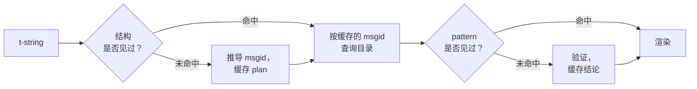

# 工作原理

使用本库并不需要本页的任何内容——[教程](tutorial.md)和[指南](guide.md)已经
覆盖了那些。本页转而从第一性原理重建这个库：t-string 究竟是什么，msgid 如何从
它自然得出，一条翻译何以有效，以及实现如何让所有这些检查只花费十分之几微秒。
如果你出于好奇、想参与贡献，或者打算[亲自实现这一约定](#reimplementing-it)，
请读下去。

## t-string 究竟是什么 { #what-a-t-string-actually-is }

f-string 产生一个 `str`，而且是立即产生——在任何函数接到它之前，值已经插好，
句子已经封死。t-string（[PEP 750]）语法相同，表达式同样急切求值，但产生的是
另一种类型：

```pycon
>>> name = "Ada"
>>> f"Hello {name}!"
'Hello Ada!'
>>> t"Hello {name}!"
Template(strings=('Hello ', '!'), interpolations=(Interpolation('Ada', 'name', None, ''),))
```

那个 `Template` 对象把目录 pipeline 需要的各个部分依然分离地保存着：

```pycon
>>> template = t"Total: {amount:,.2f}"
>>> template.strings
('Total: ', '')
>>> template.interpolations[0].expression
'amount'
>>> template.interpolations[0].value
1234.5
>>> template.interpolations[0].format_spec
',.2f'
```

- `strings` — 插值周围的字面文本，按顺序排列。
- 对每个插值：作为源代码文本的**表达式**（`'amount'`）、其求值后的**值**
  （`1234.5`），以及可能存在的**转换**（`!r`）和**格式说明**（`,.2f`）——
  它们被单独携带，而不是被直接应用。

本库所做的一切都是对这一结构的有纪律的消费。语言本身已经完成了 i18n 需要的那个
分离——静态文本与值分开——因此本库从不解析你的源代码，也从不猜测值在句子中的
位置。剩下的只是三个决定：这一结构如何变成目录 key，该 key 的翻译允许说什么，
以及二者如何重新渲染到一起。

## 从 template 到 msgid { #from-template-to-msgid }

msgid——目录索引所用的 key——只由 template 的*静态*部分推导。按源顺序遍历
`strings` 和 `interpolations`；对每个字面片段做花括号转义（`{` 变成 `{{`）；
对每个插值输出一个 `{name}` token，其中 `name` 是去掉首尾空白的表达式文本。
以 `t"Total: {amount:,.2f}"` 为例：

```text
strings         ('Total: ', '')
interpolations  expression 'amount'   conversion None   format_spec ',.2f'
msgid           'Total: {amount}'
```

这条规则的每一部分都有其理由：

- **表达式必须是简单名称**——`str.isidentifier()` 为真且不是 Python 关键字。
  `t"Hello {user.name}"` 在调用处即被拒绝。msgid 是一个 *key*：它必须在每次
  运行、每次提取中都得出完全相同的结果，而且它是给翻译者阅读的，所以占位符必须
  是一个稳定、有意义的词——而不是一段引诱目录变成表达式语言的代码片段。
- **转换和格式说明永远不进入 msgid。** 翻译者不应被迫阅读 `:,.2f`，任何翻译
  也不应能改动它。它的推论值得记住：在代码中把 `:,.2f` 收紧为 `:,.0f` 不改变
  任何 msgid，因此不会使任何语言的任何翻译失效。目录 key 追踪的是*句子说了
  什么*，而不是值如何被格式化。
- **重复出现的名称必须精确重复其格式。** `t"{x:.2f} vs {x:.3f}"` 会被拒绝，
  因为两次出现都折叠为同一个 `{x}` token，msgid 将无法再说明渲染应使用哪种
  格式。
- **空 msgid 从不被查询**，因为 gettext 把它保留给目录自身的元数据头。`t""`
  渲染为 `""`，完全不触碰目录。

完整的规则集合，包括本页略过的边界情况，见
[SPEC §2](https://github.com/yhay81/gettext-tstrings/blob/main/SPEC.md)。

## 翻译允许说什么 { #what-a-translation-may-say }

从目录返回的 pattern 用 `string.Formatter`——与 `str.format` 相同的解析器——
解析。这套语法是刻意借用而非自创的：本库接受的 pattern，就是更广阔的生态早已
理解的 pattern。随后应用两项检查。

**形态：**每个字段必须是裸 `{name}`。转换或格式说明——包括显式为空的
`{name:}`——会被拒绝，位置字段（`{0}`、`{}`）和名称带空白（`{ name }`）同样
被拒绝。最后一条比看起来更重要：`str.format` 和 GNU `msgfmt` 都拒绝
`{ name }`，如果这里接受它，产生的目录将无法被链条上的任何其他工具验证。

**名称：**将 pattern 的占位符集合与源消息的集合对照。对单数消息，每个源名称
都是*必需*的，除此之外什么都不*允许*。对复数消息，两个分支被合并：

- **允许** = 两个分支名称的并集
- **必需** = 二者的交集

因此对于 `t"One file"` / `t"{n} files"`，名称 `n` 在任一形式的翻译中都被允许，
却对哪个形式都不是必需。正是这种不对称让目标语言的复数系统得以不同于源语言——
日语用一个（大概率用到 `{n}` 的）形式翻译两个分支；形式比英语多的语言，可能
需要在英语没有的形式里使用 `{n}`。

这一切并非假设：本站自身的界面目录里就有复数消息
`Built {n} localized page` / `Built {n} localized pages`——两个英语分支——
而本站的各语言版本把这同一条消息翻译成从一种到六种不等的形式：

| 目录 | 形式数 | 各形式的译文，按形式顺序 |
| --- | --- | --- |
| 日语 | 1 | `ローカライズ済みページを{n}件ビルドしました` |
| 土耳其语 | 2 | `{n} yerelleştirilmiş sayfa oluşturuldu` ——两次、完全相同：土耳其语名词在数词之后保持单数 |
| 意大利语 | 2 | `Generata {n} pagina localizzata` · `Generate {n} pagine localizzate` ——分词随性与数一致变化 |
| 俄语 | 3 | `Собрана {n} локализованная страница` · `Собраны {n} локализованные страницы` · `Собрано {n} локализованных страниц` |
| 波兰语 | 3 | `Zbudowano {n} zlokalizowaną stronę` · `Zbudowano {n} zlokalizowane strony` · `Zbudowano {n} zlokalizowanych stron` |
| 阿拉伯语 | 6 | 其中包括表示恰好一个的 `تم إنشاء صفحة مترجمة واحدة ({n})` 和表示少数几个的 `تم إنشاء {n} صفحات مترجمة` |

每一行都是本仓库 `i18n/*/LC_MESSAGES/site.po` 中的真实条目，由
[多语言构建](index.md)在每次发布时渲染——并且有一个测试把这张表钉在那些目录
上，二者因此无法彼此漂移。

在这些边界之内，调整顺序与重复是刻意不加限制的。二者在真实语言中都有语法上的
必要，而限制出现次数只会拒绝正确的翻译，却换不来任何安全收益：翻译依然无法
*求值*任何东西，因为求值路径根本不存在——占位符只按名称在 template 已计算好的
值中查找，永远不会被交给 `eval`、`getattr` 或 `str.format` 本身。

## 渲染 { #rendering }

渲染一个已验证的 pattern，就是遍历它的各个 chunk：输出每个字面部分；对每个
占位符，取插值捕获的值并施加*源侧*的转换和格式说明——`format(convert(value,
conversion), format_spec)`。此过程保持两条保证：

- **每个不同的值在一次渲染中最多被格式化一次**，即使翻译重复了占位符。重复
  改变的是结果被插入的次数，而不是你的 `__format__` 运行的次数。
- **对复数消息，占位符从定义它的分支读取值。** 两个分支都存在的名称，读取
  *源*语言所选分支（`n == 1` 时 `singular`，否则 `plural`）捕获的值；分支专属
  的名称总是读取自己的分支，即使目标语言的复数规则让它出现在了另一种形式里。

当验证在渲染时失败，响应按 pattern 的提供者划分。来自*目录*的 pattern 会降级：
记录一条警告并渲染源文本，维持 gettext“损坏目录永不拖垮应用程序”的契约
（[指南展示了两种模式](guide.md#what-happens-when-a-catalog-is-wrong)）。
调用方直接传入的 pattern——`CompiledTemplate.render`——则始终抛出异常，
因为不存在可供降级*回退*的源文本；宽容是给目录查询准备的，不是给参数的。

## 诊断是设计的一部分 { #diagnostics-are-part-of-the-design }

占位符错误通常落在翻译者而不是程序员面前，而且往往出现在一个问题不可见的文件
里。对一个在编辑器里明明能看到那些字符的人说 `{name} is missing` 是条死路，
因此消息按三条规则计算：

- 名称中含有**不可见字符**——输入法产生的 no-break space、zero-width
  space——会在原位打印为该字符的 code point：`{<U+00A0>name}`。读者需要看到
  *在哪里*。
- 字母**混用不同书写系统**的名称——homoglyph 情况——会显示两次：一次可读、
  一次转义。因为含 Cyrillic `а` 的 `{nаme}` 在印刷上与 `{name}` 无法区分，
  转义形式 `(nаme)` 是唯一能把二者区分开的写法。
- 其余一切**照原样显示**。`{名前}` 和 `{café}` 是普通名称；转义它们反而会让
  读者找不到所指为何。

基于同一原则，一个*看起来*存在的“缺失”占位符会得到关于其缺席的解释——东亚
输入法产生的全角花括号、转义往返造成的 `{{name}}` 加倍、名称位于花括号之外。
[指南的失败消息表](guide.md#reading-a-failure-message)逐字展示了这些消息。

## 热路径 { #the-hot-path }

以上一切发生在应用程序渲染的每一条翻译字符串上，因此实现围绕一个想法构建：
**验证从不跳过，所以被缓存的必须正是验证。**



三个缓存，每个阶段一个：

- **每个调用点结构一份 plan。** template 的 `strings` 元组——解释器本来就已
  构建的对象——就是缓存 key，因此一次查找不分配任何内存。命中时，每个插值的
  表达式、转换和格式说明仍会与记录值一一比对：两个字面文本相同但格式不同的
  调用点（`t"{x:.2f}"` 对 `t"{x:.3f}"`）绝不能相撞，这个比对就是使用解释器
  免费奉上的 key 所付出的代价。
- **每个 pattern 一份结论。** 目录第一次以某个 pattern 应答时，它会被解析并
  验证；结果——一份编译好的渲染 plan，或一条无效记录——保存在 plan 上。此后
  该消息的每次渲染只需一次字典查找即可到达它。无效 pattern 同样被记住，这就是
  损坏的目录条目只警告一次、而不是每次渲染都警告的原因。
- **每对复数消息一份合并 plan**，保存并集/交集集合，让分支运算按消息只发生
  一次，而不是按调用发生。

每个缓存都有上界，且没有一个保留插值的*值*——只保留静态结构和 pattern 文本。
结果由
[`benchmarks/runtime.py`](https://github.com/yhay81/gettext-tstrings/blob/main/benchmarks/runtime.py)
测得：一条单字段消息约 0.4 µs，其中包含 t-string 本身的构建，约为不做任何检查
的普通 `gettext(...).format(...)` 的 2.5 倍。
[`core.py`](https://github.com/yhay81/gettext-tstrings/blob/main/src/gettext_tstrings/core.py)
顶部的注释记录了构成这一结论的各项具体测量。

## 亲自实现它 { #reimplementing-it }

以上没有任何内容是私藏的知识：这套约定已写成 [spec v1](spec.md)，其机器可读的
[一致性测试套件](spec.md#conformance)让提取器、IDE 插件或另一种语言的实现都能
对照本页讲解的每一条规则检验自己。本实现在自己的测试中运行该套件，这正是让
本页、规范与代码不会在沉默中彼此漂移的机制。

  [PEP 750]: https://peps.python.org/pep-0750/
