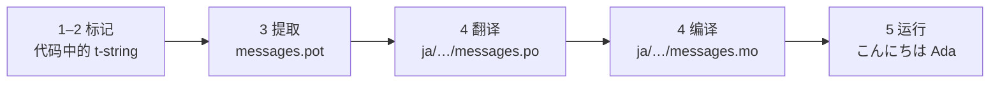

# 教程

本页从一个空目录走到一个用日语打招呼的程序。共五步，不要求任何 gettext 经验，
每条命令都附带它实际产生的输出——因此每走一步，你都知道自己是否在正确的轨道上。

你需要 Python 3.14 或更新版本，因为 t-string 是 3.14 中的新语法。
日语是本页的示例目标语言，但没有任何东西依赖这一选择——在第 4 步换成任何语言
都可以，那里的 locale 代码 `ja` 是唯一指明这一选择的地方。

## 1. 安装 { #1-install }

```console
python -m pip install "gettext-tstrings[babel]"
```

`[babel]` extra 会带来 [Babel]，即第 3 步中把消息收集进目录文件的工具。它是
开发期工具：生产代码只靠标准库即可完成渲染。

## 2. 在代码中标记一条消息 { #2-mark-a-message-in-your-code }

创建 `app.py`：

```python
from gettext_tstrings import tr

name = "Ada"
print(tr(t"Hello {name}"))
```

`t"Hello {name}"` 看起来像 f-string，但 `t` 前缀让文本与值保持分离，而不是当场
合并。正是这种分离让 `tr()` 能够为整句 `Hello {name}` 查找翻译，然后再把值插入
进去。

现在运行它：

```console
$ python app.py
Hello Ada
```

目前尚未安装任何翻译，因此源文本按原样渲染。使用本库的程序从不*要求*目录才能
运行——英语（或你的源语言）就是内置的回退。

## 3. 提取消息 { #3-extract-the-messages }

翻译者不会阅读你的源代码；在你和他们之间流转的是一个叫做**目录**的小文件。
迈向目录的第一步，是把代码中每条被标记的消息收集出来。

创建 `babel.cfg`，告诉 Babel 如何找到你的消息：

```ini
[gettext_tstrings: **.py]
encoding = utf-8
```

然后提取到模板文件（`.pot`）：

```console
$ mkdir -p locales
$ pybabel extract -F babel.cfg -c "Translators:" -o locales/messages.pot .
extracting messages from app.py (encoding="utf-8")
writing PO template file to locales/messages.pot
```

`locales/messages.pot` 现在为每条消息包含一个条目：

```po
#. gettext-tstrings
#: app.py:4
#, python-brace-format
msgid "Hello {name}"
msgstr ""
```

`msgid` 是你的代码将要查找的 key。空的 `msgstr` 是填写翻译的地方——但不是在
这个文件里：`.pot` 是*模板*，下一步会为每种语言复制一份。

## 4. 翻译并编译 { #4-translate-and-compile }

从模板创建日语目录：

```console
$ pybabel init -i locales/messages.pot -d locales -l ja
creating catalog locales/ja/LC_MESSAGES/messages.po based on locales/messages.pot
```

打开 `locales/ja/LC_MESSAGES/messages.po` 并填写 `msgstr`：

```po
msgid "Hello {name}"
msgstr "こんにちは {name}"
```

保持 `{name}` 原样不动——占位符是值在译文句子中找到自己位置的方式，翻译可以把
它移动到目标语言需要的任何位置。在真实项目中，这个 `.po` 文件就是你交给翻译者
或上传到翻译平台的东西；两种情况下格式相同。

目录以文本形式编辑，但以二进制形式（`.mo`）加载，因此需要编译：

```console
$ pybabel compile -d locales
compiling catalog locales/ja/LC_MESSAGES/messages.po to locales/ja/LC_MESSAGES/messages.mo
```

这条命令同时也是一道安全网。如果翻译损坏了占位符——比如把 `{name}` 写成了
`{nome}`——它会拒绝通过：

```console
$ pybabel compile -d locales
error: locales/ja/LC_MESSAGES/messages.po:24: translation does not match the
source placeholders: {name} is missing; {nome} is not in the source message
1 errors encountered.
```

## 5. 运行 { #5-run-it }

让 `app.py` 指向编译好的目录。点击标记，看看每一行在做什么：

```python
import gettext

from gettext_tstrings import Translator

_ = Translator(gettext.translation("messages", localedir="locales", languages=["ja"]))  # (1)!

name = "Ada"
print(_(t"Hello {name}"))  # (2)!
```

1. 标准库加载编译好的 `.mo`，`Translator` 把它绑定为一个可调用对象。`_` 是
   gettext 中“翻译这个”的约定名称——之所以这么短，是因为它会出现在每一条
   面向用户的字符串上。它与 `tr` 是同一个函数，只是绑定到了一个目录。
2. 在调用处：t-string 的文本变成查找 key `Hello {name}`，目录给出答案
   `こんにちは {name}`，答案先与源占位符核对无误，然后才把值放进去。

```console
$ python app.py
こんにちは Ada
```

这就是完整的循环，值得把它看成一幅图：



**标记 → 提取 → 翻译 → 编译 → 运行。** 本站的其余内容都是这五步之一的细化。

## 接下来 { #where-next }

- [为什么选择 t-string](comparison.md) — 与 `%(name)s`、`.format()` 和
  `$`-string 相比，这一设计保护你免受什么。
- [指南](guide.md) — 复数、按请求选择语言、延迟字符串，以及目录仍然出错时运行时
  会发生什么。
- [生产实践](workflow.md) — 同一个循环在团队中周复一周的运转方式：更新目录、
  CI 关卡与翻译平台。
- [提取](extraction.md) — 完整的 `pybabel` 参考：自定义函数名、CI 的 strict
  模式，以及守护目录的各项检查。

  [Babel]: https://babel.pocoo.org/
