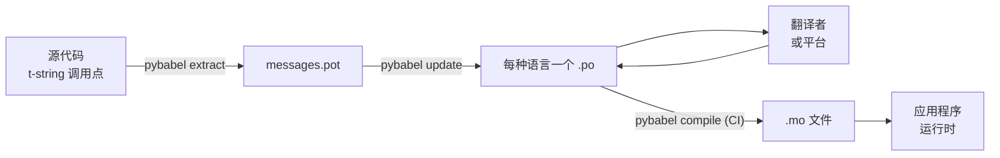

# 生产实践

[教程](tutorial.md)只把循环走了一遍——一个人，一条消息。在真实项目中，循环会
持续运转：消息在翻译完成之后仍会改变，翻译者在别处按自己的节奏工作，而每次发布
都要附带编译好的目录。本页讲的正是这种日常实践——什么留在仓库里，什么在外部
流转，CI 必须把住哪些关口，以及运行时在哪里绑定语言。

## 项目的形态 { #the-shape-of-a-project }

```text
myapp/
├── babel.cfg
├── pyproject.toml
├── src/
│   └── myapp/
└── locales/
    ├── messages.pot
    ├── ja/LC_MESSAGES/messages.po
    └── de/LC_MESSAGES/messages.po
```

请提交 `babel.cfg`、`.pot` 模板和每一个 `.po`——它们是翻译构建的源文件，
它们的 diff 就是你审阅翻译变更的方式。编译出的 `.mo` 文件是构建产物：在 CI 或
打包时生成它们，而不要提交，这样 `.po` 和它的 `.mo` 就永远不会对“将要发布什么”
产生分歧。

有一个文件在每个方向上各承担一个角色：`.pot` 把你的消息*送出去*给翻译者，
`.po` 文件把翻译*带回来*。下面的一切都是这两者之间的往来。



## 第一次翻译之后的周期 { #the-cycle-after-the-first-translation }

教程里的 `pybabel init` 每种语言只运行一次，之后再也不用。从那以后，工作周期
变成**提取 → 更新 → 翻译 → 编译**，其核心是 `pybabel update`：它把新鲜的模板
并入既有目录，而不会丢弃其中已有的翻译。

假设问候语 `Hello {name}`——已翻译为 `こんにちは {name}`——在代码中被改写为
`Welcome back, {name}`。提取并更新：

```console
$ pybabel extract -F babel.cfg -c "Translators:" -o locales/messages.pot .
extracting messages from app.py (encoding="utf-8")
writing PO template file to locales/messages.pot
$ pybabel update -i locales/messages.pot -d locales
updating catalog locales/ja/LC_MESSAGES/messages.po based on locales/messages.pot
```

日语目录现在包含：

```po
#. gettext-tstrings
#: app.py:4
#, fuzzy, python-brace-format
msgid "Welcome back, {name}"
msgstr "こんにちは {name}"
```

Babel 注意到新 msgid 与一条被删除的相似，于是把它与旧翻译配了对——但给这一对
打上了 **fuzzy** 标志：机器的猜测，等待人来确认。这个标志是有牙齿的。
`pybabel compile` **会把 fuzzy 条目排除在 `.mo` 之外**，因此在翻译者确认这一对
之前，应用程序渲染的是新的英文文本，而不是一句过时的日文：

```console
$ pybabel compile -d locales
compiling catalog locales/ja/LC_MESSAGES/messages.po to locales/ja/LC_MESSAGES/messages.mo
$ python app.py
Welcome back, Ada
```

因此，一条被修改的消息与一条损坏的消息以同样的方式降级——降到源语言，而绝不会
落到过时的翻译上。翻译者在周期中的职责是修订 `msgstr` 并删除 `fuzzy` 标志；
下一次编译就会重新收录该条目。

!!! note "占位符名称是消息身份的一部分"

    msgid 是目录的 key，而占位符的*名称*就在其中——因此在代码中重命名变量
    （`name` → `user_name`）会改变 msgid，并把每种语言对它的翻译重新送回
    fuzzy 周期。请用翻译者能读懂的词来命名插值变量，并且只在有充分理由时才
    重命名。

    格式化则正好相反：`!r` 和 `:.2f` [不属于
    msgid](internals.md#from-template-to-msgid)，所以把 `{amount:,.2f}` 收紧为
    `{amount:,.0f}` 不会改变任何目录中的任何内容。当然，改写*句子本身*是一次
    真正的变更——那就是上面的周期。

## CI 把守什么 { #what-ci-gates }

三种失败值得让构建变红：目录落后于代码、翻译破坏了占位符，或者损坏条目一路
溜到了运行时。每种失败对应一个步骤：

```yaml
- run: pybabel extract -F babel.cfg -c "Translators:" -o locales/messages.pot .
- run: pybabel update -i locales/messages.pot -d locales --check
- run: pybabel compile -d locales
- run: pytest
```

`pybabel update --check` 不改写任何文件，并在目录相对于新提取的模板已经过时的
情况下以非零状态退出——这是防止合并“消息改了却没人重新提取”的代码的关卡。
`pybabel compile` 则会运行 Babel 与本包[注册的
checker](extraction.md#your-existing-toolchain-validates-these-catalogs)
双方的占位符检查。

!!! bug "`--check` 无法为使用上下文的目录把关"

    在 Babel 2.18.0 上，`pybabel update --check` 会把**每一个**包含 `msgctxt`
    的目录都报告为已过时，每次运行都如此，无论它有多新。这项比较经由
    `Catalog.is_identical` 完成，它按每条消息的存储键去查找消息——而对带上下文
    的消息来说，那个键是 `(id, context)` 这个二元组，`Catalog.get` 并不接受它。
    于是查找一无所获，两个目录也就永远不会比较相等：

    ```pycon
    >>> from babel.messages.catalog import Catalog
    >>> c = Catalog(locale="ja")
    >>> c.add("Guide", "ガイド", context="navigation")
    <Message 'Guide' (flags: [])>
    >>> c.is_identical(c)
    False
    ```

    所以只要你用到了 `pgettext` 或 `npgettext`——而消除同形异义词的歧义正是它们
    存在的理由——这一步就会以最糟糕的方式失效开放：永远是红的，于是团队把它关掉，
    于是再没有任何东西为过时把关。在上游修复之前，请自己比较消息集合。用
    `babel.messages.pofile.read_po` 读取模板和每个目录，再比较
    `{(m.context, m.id) for m in catalog if m.id}`，这就是检查的全部，也正是
    [本站自己的构建](index.md)所做的事。

!!! danger "检查退出状态，而不是日志"

    `pybabel compile` 会报告每个占位符错误、以非零状态退出——**但仍会写出
    `.mo`**。先编译、再把 `locales/` 复制进镜像的 pipeline，除非那个非零退出
    真的能让它停下来，否则就会把损坏的目录发布出去。像上面那样让这一步使构建
    失败，就是全部的修复方案。

最后一行是你平常的测试套件，只需加上一个习惯：在其中的某处，让每种要发布的
语言至少有一条消息通过 strict 的 translator 渲染——

```python
import gettext

from gettext_tstrings import Translator

def test_catalogs_render(language: str) -> None:
    translations = gettext.translation("messages", localedir="locales", languages=[language])
    _ = Translator(translations, strict=True)
    name = "Ada"
    assert _(t"Welcome back, {name}")
```

——因为 `strict=True` [会在生产环境静默回退之处直接抛出异常](guide.md#what-happens-when-a-catalog-is-wrong)，
而一次运行时渲染是唯一以应用程序的视角——连同 `.mo` 在内——看到目录的检查。

## 与翻译者及平台协作 { #working-with-translators-and-platforms }

`.po` 文件是整个 gettext 世界的交换格式，这正是本库沿用它的原因：交接翻译就是
交接一个文件，无论接收方是使用 PO 编辑器的同事，还是 Weblate、Crowdin 这样的
平台。三件事能让这次交接顺利进行：

**说明消息的用途。** 代码中的注释会随消息一起流转——这正是
`-c "Translators:"` 标志所收集的内容：

```python
from gettext_tstrings import tr

name = "Ada"
# Translators: shown on the dashboard right after sign-in
print(tr(t"Welcome back, {name}"))
```

```po
#. Translators: shown on the dashboard right after sign-in
#. gettext-tstrings
#: app.py:5
#, python-brace-format
msgid "Welcome back, {name}"
msgstr ""
```

翻译者会在世界另一端的编辑器里、就在消息旁边看到那条注释。这是整个工作流中
成本最低的质量杠杆。对于一词多义的情形——按钮上的 "Open" 与状态里的
"Open"——请用 `pgettext` 给消息一个[上下文](guide.md#binding-a-catalog)，
它会成为目录中可见的 `msgctxt`。

**让平台验证占位符。** 每条从 t-string 提取的消息都带有 `python-brace-format`
标志，正是这一行在你无法控制的工具中开启了占位符 QA——Weblate 记录了这项检查，
商业平台基于同一标志提供各自的检查，`msgfmt --check-format` 则在任何 GNU
pipeline 中强制执行它。细节以及内置 checker 在此之外还能捕获什么，参阅
[提取页](extraction.md#your-existing-toolchain-validates-these-catalogs)。

**对安全网的信任止于其边界。** 从平台回来的任何内容仍然是进入你构建的数据；
上面的 CI 关卡才是把“平台大概检查过了”变成“这不可能以损坏状态发布”的东西。

## 在运行时绑定语言 { #binding-a-language-at-runtime }

到此为止的一切都在生产目录。剩下的决定是应用程序在哪里选择目录，而它只有一个
诚实的答案：按*语言的作用域*绑定一次——CLI 的作用域是进程，Web 服务的作用域是
请求。

=== "一个进程，一种语言"

    命令行工具或桌面应用在启动时读取一次用户环境。不传 `languages=`，标准库
    就会从 `LANGUAGE`、`LC_ALL`、`LC_MESSAGES` 和 `LANG` 中协商；
    `fallback=True` 会在它们都匹配不到你发布的目录时返回一个空目录——即源
    文本——而不是抛出异常。

    ```python
    import gettext

    from gettext_tstrings import Translator

    _ = Translator(gettext.translation("messages", localedir="locales", fallback=True))

    name = "Ada"
    print(_(t"Welcome back, {name}"))
    ```

=== "Flask"

    Web 应用按请求决定。在 import 时把每个目录加载一次，然后在视图运行之前把
    协商出的目录绑定到上下文——[`set_translations`](guide.md#per-request-language)
    是上下文局部的，因此不同语言的并发请求永远不会看到彼此的绑定。

    ```python
    import gettext

    from flask import Flask, request

    from gettext_tstrings import set_translations, tr

    LANGUAGES = ("en", "ja", "de")
    CATALOGS = {
        language: gettext.translation(
            "messages", localedir="locales", languages=[language], fallback=True
        )
        for language in LANGUAGES
    }

    app = Flask(__name__)

    @app.before_request
    def bind_language() -> None:
        language = request.accept_languages.best_match(LANGUAGES) or "en"
        set_translations(CATALOGS[language])

    @app.get("/")
    def home() -> str:
        name = "Ada"
        return tr(t"Welcome back, {name}")
    ```

=== "ASGI 中间件"

    在异步 framework 下——FastAPI、Starlette 以及其他任何 ASGI 应用——用
    [`use_translations`](guide.md#per-request-language) 包住请求：绑定存放在
    `ContextVar` 中，异步任务切换会按请求保留它。

    ```python
    import gettext

    from fastapi import FastAPI, Request

    from gettext_tstrings import tr, use_translations

    LANGUAGES = ("en", "ja", "de")
    CATALOGS = {
        language: gettext.translation(
            "messages", localedir="locales", languages=[language], fallback=True
        )
        for language in LANGUAGES
    }

    app = FastAPI()

    @app.middleware("http")
    async def bind_language(request: Request, call_next):
        language = negotiate_language(request.headers.get("accept-language"), LANGUAGES)
        with use_translations(CATALOGS[language]):
            return await call_next(request)
    ```

    `negotiate_language` 代表你的 Accept-Language 解析——大多数 framework
    或其生态都提供现成实现；这里的关键是围绕 `call_next` 的绑定。

两条运行时习惯补全全景。import 时创建的字符串——表单标签、枚举的显示名——
绝不能捕获 import 期间恰好生效的语言；用
[`lazy_gettext`](guide.md#deferred-translation) 定义它们，它们就会以*使用时*
生效的语言渲染。另外，请把 `gettext_tstrings` logger 引到有人查看的地方：它的
警告是 lenient 模式在报告一条越过了所有关卡的翻译，每条损坏消息一行，而不是
每次渲染一行。

## 发布 { #shipping }

生产环境需要的只有本包和 `.mo` 文件，别无其他。Babel 是开发与 CI 依赖——让
`gettext-tstrings[babel]` 远离生产镜像，在那里只安装裸包；渲染只靠标准库运行。
请在生成部署产物的同一次构建中编译目录，这样产物中的 `.mo` 文件与经过审阅的
`.po` 文件完全一致，任何在某人笔记本上编译出来的东西都永远不会被发布。

发布之前，本页可以归结为这份清单：

- `pybabel update --check` 通过——没有消息在目录不知情的情况下被修改。
- `pybabel compile` 以退出状态作为构建关卡。
- 剩余的 `fuzzy` 条目都是有意保留的——在翻译者确认之前，每一条都渲染为源文本。
- 测试套件用 `strict=True` 把每种要发布的语言各渲染一次。
- 生产产物包含 `.mo` 文件，且不含 Babel。
- `gettext_tstrings` logger 已接入监控。

## 接下来 { #where-next }

- [提取](extraction.md) — 本页工具一侧的参考：mapping 选项、自定义函数名、
  strict 模式，以及每一项 checker。
- [指南](guide.md) — 运行时一侧：复数、上下文、延迟字符串，以及各失败模式的
  细节。
- [工作原理](internals.md) — msgid 为什么长成这样，以及验证究竟检查什么。
